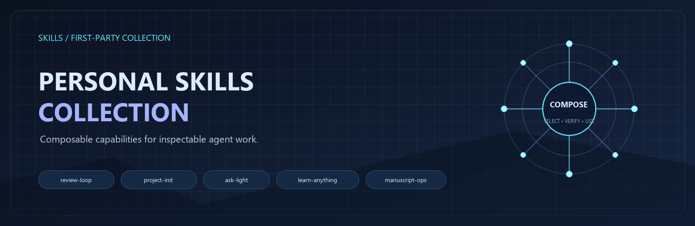

[中文说明](README.zh-CN.md)

# Personal Skills Collection

`LightDevCoder/skills` is the public, first-party home for seven installable
Agent Skills on the current branch. Each package is independently discoverable,
explicit about its invocation boundary, and small enough to inspect before use.

> **About:** Personal Skills Collection — Drive your creativity

> **Release:** [v0.1.1](https://github.com/LightDevCoder/skills/releases/tag/v0.1.1)
> is published from commit `c50f1ef`. The release record and fresh-install evidence
> live in [docs/evidence/releases/v0.1.1/](docs/evidence/releases/v0.1.1/).
>
> **Release status:** The collection is published and usable. Installation and
> `collection-quality` checks passed for all five first-party Skills. The
> remaining release-acceptance limitation is the independent evaluator evidence
> for the `review-loop agent-skill` gate: that evidence is `BLOCKED` because a
> fresh independent evaluator record is not attached. This does not block
> installation or ordinary use; see the [release receipt](docs/evidence/releases/v0.1.1/RELEASE_RECEIPT.md)
> and [limitations](docs/evidence/releases/v0.1.1/LIMITATIONS.md) for the detailed boundary.
>
> **Current branch admission:** `recap` and `language-learning` both passed the low-risk prompt-only fast track. Both remain unreleased; stable `v0.1.1` contains the original five packages.

## Quick Start

Install the published first-party collection:

```text
npx skills add LightDevCoder/skills#v0.1.1 --yes --copy --agent codex
```

Install one Skill at the same published revision:

```text
npx skills add LightDevCoder/skills#v0.1.1 --skill review-loop --yes --copy --agent codex
```

Refresh the Agent host, then confirm that the package is visible in its Skill
catalog. If the host exposes a filesystem, inspect the installed package's
`SKILL.md` and `agents/openai.yaml`; discovery without the source checkout is
the meaningful check. The exact CLI version, destination, and result are in
[INSTALLATION_VERIFICATION.md](docs/evidence/releases/v0.1.1/INSTALLATION_VERIFICATION.md).

The first useful entry point when the next move is unclear is `$ask-light`:

```text
$ask-light next
```

Four short examples:

```text
$ask-light next       # recommend one next Skill; do not invoke it
$project-init         # initialize a confirmed minimal project preset
$recap                # summarize the current session in one line
$review-loop init     # freeze an already-approved acceptance baseline
```

`ask-light` is the only router in these examples. It reports a recommendation
or a bounded recipe and stops; it never invokes, installs, or orchestrates the
result. Read [Quick Start](examples/quick-start/README.md), the [Skill user
guides](docs/skills/), and [workflow recipes](docs/workflows/) for inputs,
outputs, handoffs, and stopping boundaries.

## External capabilities

The current branch contains seven first-party packages on this branch: the five
in v0.1.1 plus the newly admitted, unreleased `recap` and `language-learning`
packages.

Optional workflow capabilities are external or third-party dependencies and are
not included by default:

- `grill-me` / `grilling` — `grill-me` is the user-facing entry point for a
  one-session clarification interview; it starts the underlying model-invoked
  `grilling` capability. Treat them as one capability, not two workflow steps.
- `research` — investigate an external fact or practice when a local preset is
  insufficient.
- `to-spec` — turn an approved goal and constraints into a traceable
  specification.
- `to-tickets` — turn an approved specification into dependency-ordered
  tickets.
- `implement` — carry out one bounded, unblocked implementation ticket.
- `code-review` — provide specialist findings for a fixed change.
- `handoff` — preserve an accepted result or blocker for closeout or resumption.

These capabilities may come from `mattpocock/skills` or another external
source. This repository does not copy them or install them automatically;
check their availability before selecting a workflow that names them.

## First-party catalog

| Skill | Purpose | Invocation | Package |
| --- | --- | --- | --- |
| [review-loop](skills/review-loop/SKILL.md) | Run bounded evidence, repair, and final-acceptance loops. | Model-invoked; manual entry point is supported. | skills/review-loop/ |
| [project-init](skills/project-init/SKILL.md) | Initialize a confirmed software, manuscript, research, knowledge, data, or Skill-development project preset. | User-invoked only. | skills/project-init/ |
| [ask-light](skills/ask-light/SKILL.md) | Inspect the active host and recommend one appropriate next Skill or bounded recipe without executing it. | User-invoked only. | skills/ask-light/ |
| [language-learning](skills/language-learning/SKILL.md) | Tutor for any target language through six study modes: lessons, flashcards, conversation, grammar, quizzes, and immersion. | User-invoked only. | skills/language-learning/ |
| [recap](skills/recap/SKILL.md) | Summarize the current Agent session in exactly one line without changing history or continuing the task. | User-invoked only. | skills/recap/ |
| [learn-anything](skills/learn-anything/SKILL.md) | Distill sufficiently evidenced source material into reusable Agent Skill methods. | User-invoked only. | skills/learn-anything/ |
| [manuscript-ops](skills/manuscript-ops/SKILL.md) | Govern reproducible manuscript engineering across formats, batches, reviews, and handoffs. | Model-invoked; manual entry point is supported. | skills/manuscript-ops/ |

[CATALOG.md](CATALOG.md) is the human-readable inventory. Package-level
`SKILL.md` files remain the behavior authority; the guides explain usage
without creating a second contract.

## Composition without a fixed workflow

The collection is composable rather than a required pipeline. Recipes in
[docs/workflows/](docs/workflows/) document explicit handoffs such as
specification → tickets → implementation → specialist review → final
`review-loop` verdict. They are documentation and validation assets, not an
automatic orchestration engine and not a replacement for the retired
`project-workflow` package.

## Ownership and upstream boundaries

| Source state | Authority | Treatment here |
| --- | --- | --- |
| First-party | This repository and its admitted package contracts | Included under `skills/`. |
| Direct upstream | The original upstream repository | Install directly; do not copy an unchanged Skill here. |
| Modified third-party | The private `LightDevCoder/skills-3rdParty` repository | Keep provenance, patches, licenses, sync locks, and install evidence. |
| Deprecated or archived | The released migration record | Keep history and point users to the current authority. |

Matt Pocock Skills that are not first-party remain at
[mattpocock/skills](https://github.com/mattpocock/skills). The selected private
third-party snapshot is maintained separately at
[LightDevCoder/skills-3rdParty](https://github.com/LightDevCoder/skills-3rdParty)
and is never copied into this public collection.

## Governance and evidence

- [Maintenance contract](AGENTS.md)
- [Skill admission](docs/SKILL_ADMISSION.md)
- [Maintenance and synchronization](docs/MAINTENANCE.md)
- [Installation and fresh-install verification](docs/INSTALLATION.md)
- [Review policy](docs/REVIEW_POLICY.md)
- [Catalog](CATALOG.md)
- [Changelog](CHANGELOG.md)
- [Release receipt](docs/evidence/releases/v0.1.1/RELEASE_RECEIPT.md)
- [recap admission evidence](docs/evidence/admissions/recap/README.md)
- [language-learning admission evidence](docs/evidence/admissions/language-learning/README.md)
- [Collection discovery test](tests/collection-discovery-tests.ps1)
