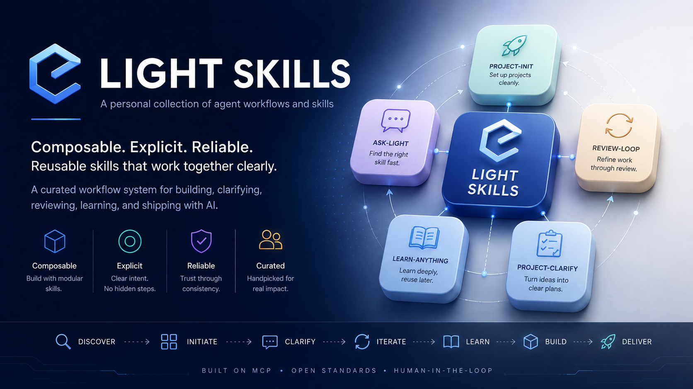

[English README](README.md)



# Light Skills — 可组合的 Agent 工作流

`LightDevCoder/skills` 包含 33 个第一方 Agent Skill，既可串联用于软件项目的规划、编码与审查，也可按需单独使用。每个包位于 `skills/<name>/`，由包内的 `SKILL.md` 统领具体行为。

> **发布版本：** [v0.2.0](https://github.com/LightDevCoder/skills/releases/tag/v0.2.0) 发布自 commit `9c2572b`（tag `v0.2.0`），是当前包含 33 个第一方 Skill 的最新稳定版本。

## 概述

仓库按实际开发场景划分为以下模块：

- **项目工作流（Project Workflow）：** 覆盖从项目初始化到最终发布的全流程。
- **澄清与调研（Clarification & Research）：** 在编码前理清需求、查阅一手资料。
- **执行（Execution）：** 结合环境特征执行边界清晰的开发任务。
- **审阅（Review）：** 包含只读专家检查与项目最终验收。
- **专项工作流（Specialized Workflows）：** 针对文稿、知识库、语言学习与看板任务的专属工具。
- **路由导航（Router）：** `ask-light` 检查工作区状态并推荐下一步。

技能编写参考 Matt Pocock Skills 的渐进式结构与 Sol Advisor 的环境检查设计，作为设计参考且不引入运行时外部依赖。

## 安装

使用 Skills CLI 交互式安装 Light Skills：

```bash
npx skills add LightDevCoder/skills
```

安装单个 Skill：

```bash
npx skills add LightDevCoder/skills --skill project-review
npx skills add LightDevCoder/skills --skill research
```

指定 v0.2.0 稳定版本安装：

```bash
npx skills add LightDevCoder/skills#v0.2.0
```

直接指定目标 Agent：

```bash
npx skills add LightDevCoder/skills --agent claude-code
```

详细安装选项（指定 Agent、独立复制模式、非交互式 CI 安装）、手动复制方式与验证记录见[安装指南](docs/INSTALLATION.zh-CN.md)。

## 快速上手

```text
$ask-light next        # 根据当前上下文推荐合适的 Skill
$project-init          # 初始化项目基础结构与任务契约
$clarify               # 通过针对性提问澄清模糊需求
$project-clarify       # 结合已有代码与文档澄清项目决策
$implement             # 执行明确的开发任务并完成验证
$project-review        # 执行最终验收：PASS / FAIL / BLOCKED
```

## 主工作流

完整项目开发推荐遵循以下阶段，也可根据任务现状随时直接切入：

```text
project-init
      ↓
project-clarify
      ↓
project-spec
      ↓
project-tickets
      ↓
implement
      ↓
project-review
      ↓
release-workflow
```

- `project-init`：创建任务契约与基础配置。
- `project-clarify → project-spec → project-tickets`：理清需求细节、固化 SPEC 文档并拆分为可执行任务。
- `implement`：逐个执行任务并运行自动化测试。
- `project-review`：对照冻结基线验证质量；`review-loop` 负责多轮修复。
- `release-workflow`：执行发布验证、打 tag 并完成发布。

常用单项任务路径：

```text
clarify                          # 独立需求澄清与共识确认
implement                        # 直接执行明确的任务
diagnosing-bugs → implement      # 定位疑难问题并完成修复
release-workflow                 # 仅执行发布流程
$ask-light                       # 任务不确定时获取路由建议
```

完整组合说明见 [docs/zh-CN/workflows/](docs/zh-CN/workflows/)。

## 任务路由建议

```text
$ask-light next
$ask-light workflow
```

`ask-light` 是只读路由器。它会分析当前工作区状态与仓库内的 33 个 Skill，推荐最合适的下一步行动或工作流组合，并在操作前向你解释推荐理由。

详见 [ask-light](skills/ask-light/SKILL.md) 与 [docs/zh-CN/workflows/](docs/zh-CN/workflows/)。

## 能力概览

| 分组 | Skill | 详细文档 |
| --- | --- | --- |
| **项目流程** | `project-init`、`project-clarify`、`project-spec`、`project-tickets`、`implement`、`project-review`、`release-workflow` | [CATALOG.zh-CN.md](CATALOG.zh-CN.md) |
| **澄清与调研** | `socratic`（引擎）、`clarify`、`project-clarify`、`decision-map`、`research`、`prototype`、`to-questionnaire` | [clarification-system](docs/zh-CN/workflows/clarification-system.md) |
| **任务执行** | `implement`、`agent-config`、`tdd`、`diagnosing-bugs`、`resolving-merge-conflicts` | [execution](docs/zh-CN/workflows/execution.md) |
| **质量审阅** | `review-loop`（引擎）、`generic-review`、`code-review`、`project-review`（验收） | [review-system](docs/zh-CN/workflows/review-system.md) |
| **专项工具** | `manuscript-ops`、`kb-init`、`learn-anything`、`language-learning`、`kanban-worker`、`eli5`、`recap` | [specialized-workflows](docs/zh-CN/workflows/specialized-workflows.md) |
| **协作效率** | `handoff`、`wizard`、`wait-what`、`writing-for-agents` | [CATALOG.zh-CN.md](CATALOG.zh-CN.md) |

每个 Skill 的完整功能、使用时机与调用方式见 [CATALOG.zh-CN.md](CATALOG.zh-CN.md)。

## 溯源与归属

| 来源分类 | 管理策略 | 仓库内处理方式 |
| --- | --- | --- |
| 第一方原生 | 集合所有者原创 | 维护于 `skills/<name>/`。 |
| 经批准 Port（Matt Pocock） | 保留上游行为并附 `ATTRIBUTION.md` | 自包含于 `skills/<name>/`，无外部运行时依赖。 |
| 第三方未修改 | 外部原作者维护 | 建议直接从上游安装，本仓库不冗余存放。 |
| 第三方定制修改 | 私有仓库 `LightDevCoder/skills-3rdParty` 托管 | 记录完整补丁、许可证与同步状态。 |
| 历史独立迁移 | 整合并入主集合 | 在发布记录中记载迁移历史与退役状态。 |

经批准的 Matt Port（共 11 个）：`research`、`prototype`、`tdd`、`handoff`、`diagnosing-bugs`、`wizard`、`teach`、`wait-what`、`to-questionnaire`、`writing-for-agents`、`resolving-merge-conflicts`。各包均含 `ATTRIBUTION.md`，无需在运行时安装上游包。

## 治理与参考文档

- [维护契约](AGENTS.md)
- [Skill 准入规范](docs/SKILL_ADMISSION.zh-CN.md)
- [维护与文档同步](docs/MAINTENANCE.zh-CN.md)
- [安装指南](docs/INSTALLATION.zh-CN.md)
- [审阅策略](docs/REVIEW_POLICY.zh-CN.md) · [Reviewer 契约](docs/REVIEWER_CONTRACT.zh-CN.md)
- [目录](CATALOG.zh-CN.md) · [变更记录](CHANGELOG.zh-CN.md)
- [工作流指南](docs/zh-CN/workflows/)
- [发布收据](docs/evidence/releases/v0.2.0/RELEASE_RECEIPT.zh-CN.md)
- [集合发现测试](tests/test_collection_discovery.py) · [组合测试](tests/test_composition.py)
