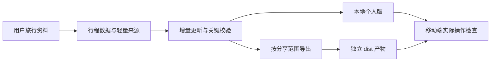

# Light-TravelPage：上游评估与首版建议

评估日期：2026-09-12。状态：评估与设计建议，尚未实现或准入 skills 仓库。

用户已明确：多人云同步是核心，首版采用 GitHub + Cloudflare 部署。本地预览用于开发验证，不能作为最终交付。

## 结论

值得吸收的是“资料驱动、固定模板、移动端行程入口、本地记账、确定性地图生成”。建议把 Light-TravelPage 定位为“把旅行资料生成并持续更新为可随身使用、按分享范围导出的旅行网页”。单纯改名、缩短提示词或换皮不足以形成第一方能力。

本轮检查了上游 Skill、构建器、轻量校验器、存储实现、可选 D1 API、相关参考文档及许可证；运行原有校验和存储测试，并复现两种坏输入漏检。浏览器读取了小红书正文和部分视频画面（包含移动端结算展示），未完成整段视频逐字转录，也未做真实旅行或云端部署验收。

## 基线

- 上游：https://github.com/do-tongxue/Travel-Plan-Page
- 固定提交：`ed869d21b19b7afb4a33fef97715c1091f087563`
- 本地只读参考：`upstream/`，保留供后续实现比对。
- 视频：https://www.xiaohongshu.com/discovery/item/6aa3832c00000000280014f7
- 目标仓库：`/Users/light/Documents/Projects/Configurations/skills`，本轮未改动。

## 优化优先级

### P0：让轻量校验覆盖旅行关键事实

`upstream/scripts/validate-lite.mjs:78-86` 主要检查日期是否非空、Day 数量和容器形状，没有验证真实日历日期、起止顺序和行程门票引用完整性。

实际复现：`review-evidence/invalid-dates.json` 包含 `2026-99-99`、`not-a-date` 及倒置的起止日期；`dangling-ticket.json` 引用不存在的 `missing-ticket`。两者均退出 0 且报告 `ok: true`。合法最小样本也通过。结果见 `review-evidence/validation-results.json`。

建议保留轻量路径，加入真实日期、时间格式、日期跨度、航段时区、关键 ID 引用、PDF 文件存在性检查。区分“明确待补充”和“结构无效”；未知日期可以生成草稿，但不得为通过校验猜日期。行程事实校验、浏览器可用性和分享检查分别报告结果。

### P0：明确首次生成与增量更新

`upstream/SKILL.md:115` 附近的流程以空白输入一次性生成为主，缺少更新既有行程的操作合同；存储键依赖 `tripId`（`runtime-storage.js:75`），重建身份可能使原记录看似消失。

新增两条执行分支：新建时初始化；更新时定位既有旅程，保留 tripId、未变记录 ID、用户编辑和运行数据，只修改受影响内容。更新前保留可恢复版本，展示简明变更摘要。新增材料与既有事实冲突时，只询问该冲突。

无需恢复旧框架的全量 provenance 和 18 类 ID。只给时间、酒店、订单、地点等易冲突字段保留轻量来源索引；仅对存在关联关系的实体使用稳定 ID。

### P0：把分享边界落实到构建输出

本地保留用户授权的完整门票有合理用途，不应为了制作本地页面反复询问隐私。问题在于后续导出：普通路径把完整资料放入页面资源，主要靠最终提醒约束分享；预览服务以项目根目录为静态根（`local-preview-server.mjs:6,36`），校验器只扫描 trip JSON 中部分 Secret 模式（`validate-lite.mjs:230-241`）。它不是公开产物验证器。

建议本地个人版保留授权资料；生成分享版时，从同一行程源派生独立 `dist/`，按明确字段和资源清单导出。公开版本排除订单 PIN、完整票据和二维码等未获公开授权内容；受限同行分享另定义允许范围。验证实际 HTML、JSON、资源与 PDF 清单，而非只隐藏 UI。发布目标只指向对应产物目录。

### P1：把固定两轮确认改成按信息缺口提问

`upstream/SKILL.md:71-112` 固定模块顺序、两次停顿、固定进度话术，即使用户已说清模块和“缺的先留空”也要求回复。

已有明确选择直接执行；模块和缺口需要决定时合并询问；无关缺口标注待补充。保留“少量缺失不阻塞”和“不给用户编造事实”。默认交付短摘要、实测预览链接、待补充项，不写死耗时估计或下一步部署平台。

### P1：区分路线示意与真实导航

原地图明确不追求真实比例，按旅行签名哈希选择模板，并在增密时疏散点位。这适合概览，不适合推断实际路程。`scripts/build-map.mjs:145-156` 的签名含地点与路线，输入变化可能改变底图选择；相同输入可复现不等于后续小改动视觉稳定。

保留示意图并明确标注用途；真实导航通过可替换的地图链接提供。初次选定后持久化模板选择，日程更新尽量稳定；确需重排时解释变化。跨国总览保留交通衔接，详细地图再按区域拆分。对未知坐标显示待定位，不把估计画成已确认事实。地理编码和外部地图仅在实际需要时调用。

### P0：多人云同步与恢复能力纳入首版

原有本地存储已有按旅程隔离和跨模块保存保护，这是值得保留的基础。当前存储失败会退到内存并写控制台（`runtime-storage.js:132,145`）；应让用户看到未持久化状态，并提供导出/导入备份。当前查阅的页面与存储文件未发现用户备份入口。

上游 `references/known-issues.md` 明确记录 D1 settings 不共享、Todo/Ticket 写入失败无回滚和可见错误，以及双设备未验证。API 文件内未见身份或旅程权限校验；这不能证明作者线上没有外部访问保护，但直接复用该 API 不能据此声称已有访问控制。

首版以可部署的多人共享网页为目标：GitHub 管理代码与部署版本，Cloudflare Pages 托管前端，Pages Functions 提供同源 API，D1 保存账单、成员、设置、Todo 和门票状态。认证与旅程授权、可见写入状态、失败重试/回滚、并发冲突检测、设置同步和真实双设备验证均属首版范围。本地存储用于缓存与恢复，不能作为共享数据源；日常记账不通过 GitHub 提交更新。

同步至少覆盖写后刷新、重新进入页面拉取和页面可见时轻量轮询。关键写入用版本校验避免静默覆盖，重试需幂等以免重复记账。行程更新后，同行者应读取同一内容版本。

参考：[Pages Functions 的 D1 绑定](https://developers.cloudflare.com/pages/functions/bindings/)。

### P1：以移动端真实任务作为最低验收

原入口将深入移动端交互检查后置，HTTP 200 本身不能证明用户能用。首版至少检查窄屏当日行程、门票打开与回退、地图/导航、记账保存后刷新恢复；测试关闭模块不残留空入口。新增金额算法时再做专门的分摊、汇率和舍入测试，不能把存储测试当金额算法证据。

### P2：精简 Skill 包并保留溯源

入口正文 211 行，混有产品规则、字段清单、地图实现、确认话术和交付模板；仓库还保留 advanced/canonical 的旧七模块流程，虽然标注了非普通路径，打包时仍有误读和维护成本。

建议短入口只负责触发、新建/更新分支、核心不变量、按需引用、交付判据。数据契约、地图、共享部署分别按需读取。只打包活跃模板及其依赖，不搬进历史框架和闲置边界库。

## 建议的首版结构

展示名保留用户指定的 **Light-TravelPage**；安装标识与目录建议 `light-travelpage`。

```text
skills/light-travelpage/
  SKILL.md                 资料生成/更新旅行页的入口
  ATTRIBUTION.md           上游提交、许可、复用范围与 Light 改造
  agents/openai.yaml       展示名与调用元数据
  references/
    data-contract.md       日期、来源、身份、关联、缺失状态
    update-and-export.md   增量更新与个人/分享产物边界
  scripts/                 经测试的生成、校验、导出工具
  assets/template/         实际使用的网页模板与许可证
```

这是职责建议，不要求创建空目录。调用类型建议 model-invoked：用户明确要求旅行网页新建或更新时可匹配；不接管纯旅游问答、订票支付和未经请求的部署。若用户要求从零规划旅行，应先明确规划范围、查证动态信息，再进入页面生成；不得默默把模板填空扩展为旅行规划。



首版完成资料生成、增量更新、示意图与导航、票据、多人记账与状态同步、备份恢复，以及 GitHub + Cloudflare 实际部署。交付判据包括真实线上地址、成员访问隔离、两个独立会话的读写同步、同记录并发冲突、断网恢复和重复请求不重复记账。更多视觉主题可以后续扩展，多人协作不后置。公开展示版按需导出，同行共享通过受限入口访问。

## 仓库收录条件

已读取目标仓库 `AGENTS.md`、`docs/SKILL_ADMISSION.md` 和 `docs/MAINTENANCE.md`。其第一方边界要求实质转化，不能将普通上游改名或轻改后直接收录；若能力仍主要属于第三方修改版，应按该仓库规则放入 `skills-3rdParty`。

本建议需通过实际实现与证据证明独立价值。因为涉及文件、脚本和产物输出，不符合 prompt-only 快速通道。正式收录需结构/安装发现、成功/边界/失败行为、调用边界、脚本负例、独立评审和最终准入结论，并同步受影响目录、文档与 changelog。此处仅说明已有仓库合同，不额外创建审批流程。

复用上游代码或素材时保留其 MIT 文本与适用第三方 notice，在 `ATTRIBUTION.md` 固定来源提交并列出 Light 改造。没有复用的地图数据不必一并打包；实际复用范围决定 notice 范围。

## 已运行的验证

- `npm run validate`：空白底板通过，提示尚未首次生成。
- `npm run test:runtime`：7/7 通过，覆盖本地存储隔离、模块保存以及 D1 选择/路径边界。
- `node scripts/validate-lite.mjs --trip <fixture> --json`：合法最小样本通过；非法日期、悬空门票引用均漏检。
- 未运行真实 D1、双设备同步、完整浏览器矩阵或全量分账算法验证；不据本轮评估声称整个上游安全或已验收。

复现坏输入：在 `upstream/` 运行 `node scripts/validate-lite.mjs --trip ../review-evidence/invalid-dates.json --json`，以及将文件名换为 `dangling-ticket.json`。所有复现资料均为虚构数据。
